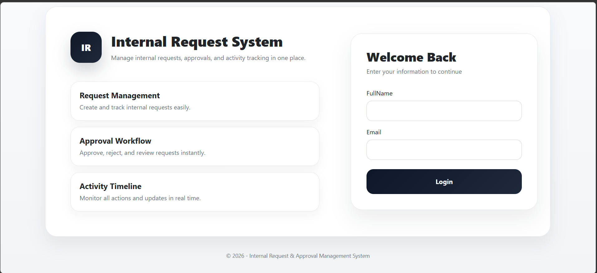
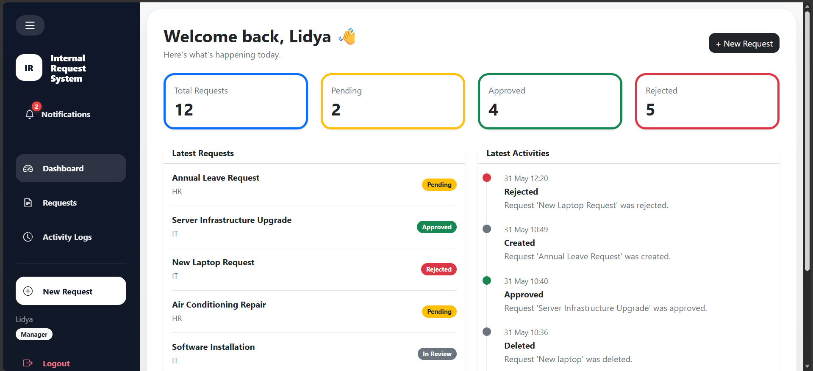
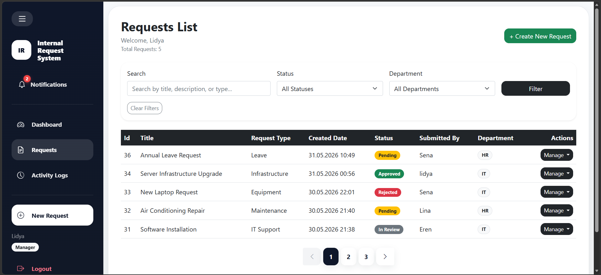
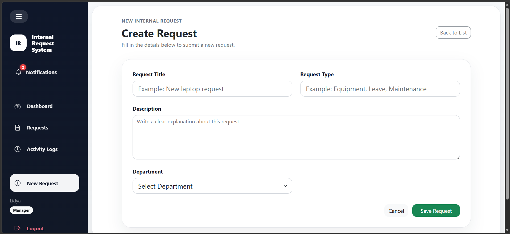
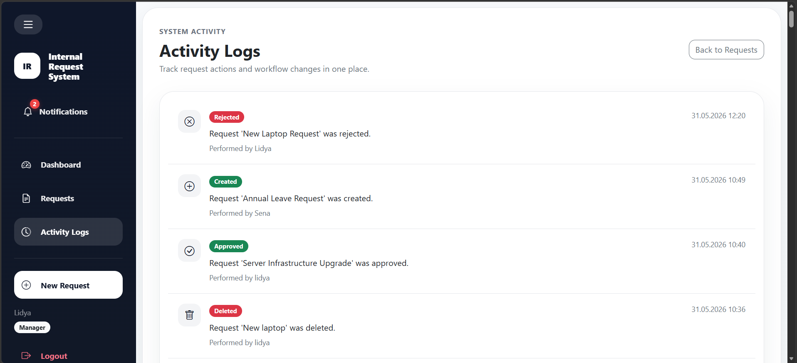

# Internal Request & Approval System

An ASP.NET Core MVC web application for managing internal company requests and approval workflows.

---

## Project Overview

Internal Request & Approval System is a web-based application developed using ASP.NET Core MVC.

The system allows employees to create requests, track their status, and manage approval processes inside an organization.

This project was developed for the Internet Programming course and focuses on MVC architecture, Entity Framework Core, CRUD operations, validation, and relational database design.

---

## Features

### Request Management

- Create requests
- View request details
- Edit requests
- Delete requests

### Approval Management

- Approve requests
- Reject requests
- Track approval decisions

### Activity Logs

- Record user actions
- Track request updates
- View system activity history

### Validation

- Required field validation
- Email validation
- Error messages using Data Annotations

### User Interface

- Shared Layout structure
- Responsive design with Bootstrap
- Razor Views

---

## Key Highlights

- Role-based request management
- Approval workflow tracking
- Activity logging system
- Responsive Bootstrap interface
- Entity Framework Core integration
- Validation using Data Annotations

---

## Technologies Used

- ASP.NET Core MVC
- C#
- Entity Framework Core
- SQL Server (LocalDB for development)
- Razor Pages
- HTML
- CSS
- Bootstrap
- JavaScript
- Git
- GitHub

---

## Project Structure

```text
Controllers/
Models/
Views/
Data/
Migrations/
wwwroot/
```

---

## Database Tables

### AppUsers

Stores user information.

### Departments

Stores department information.

### Requests

Stores employee requests.

### Approvals

Stores approval decisions.

### RequestLogs

Stores activity logs.

---

## MVC Architecture

### Models

Represent database entities and business data.

### Views

Display information using Razor syntax.

### Controllers

Handle requests and connect Models with Views.

---

## Screenshots

### Login Page



### Dashboard



### Request List



### Create Request



### Delete Confirmation


### Activity Logs



---

## Installation

Clone the repository:

```bash
git clone https://github.com/lidya-abdi/REPOSITORY_NAME.git
```

Restore packages:

```bash
dotnet restore
```

Apply migrations:

```bash
dotnet ef database update
```

Run the project:

```bash
dotnet run
```

---

## Learning Outcomes

This project demonstrates:

- MVC Architecture
- Entity Framework Core
- CRUD Operations
- Data Validation
- Database Relationships
- Razor Syntax
- Layout Usage
- Git and GitHub Workflow

---

## Developer

Lidya Abdi

Computer Engineering Student

Mersin University
